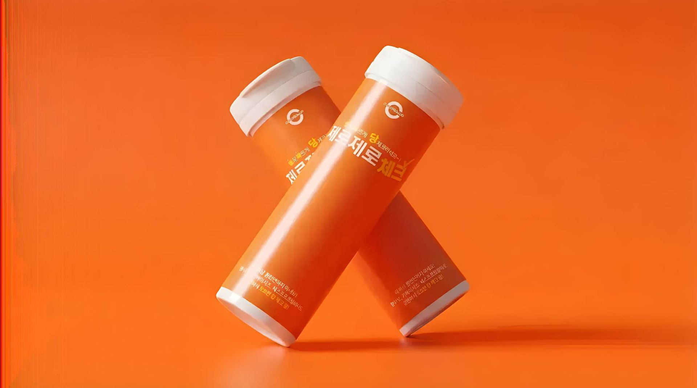

# 제로제로체크 ZeroZero Check

**이 음료, 정말 제로슈가 맞을까? 마시기 전에 5~10초면 확인해요.**
*Is your drink really sugar-free? Find out in seconds, before you sip.*

## 제품 소개

**제로제로체크**는 (주)큐라힐바이오가 만든 **휴대용 당 검사지(스트립 타입)** 입니다.
검사지를 음료에 적시면 5~10초 안에 색 변화로 당이 들어 있는지 알려줍니다.

| | |
|---|---|
| 🟦 **색 변화 없음** | 당이 없는 제로 음료 |
| 🟫 **황갈색으로 변함** | 당이 들어 있는 음료 |
| 📦 **구성** | 1통 100회분 |
| 👜 **휴대성** | 가방·주머니에 들어가는 소형 디자인 |

카페 키오스크 주문 실수, 매장 제조 실수, 비슷한 포장 때문에 제로 음료 대신 일반 음료를 마시게 되는 일을 막아줍니다.

## 이런 분께 추천해요

- 당뇨가 있는 분과 가족
- 부모님 건강을 챙기는 자녀
- 다이어트·체중 관리 중인 분
- 제로 음료를 즐기는 모든 분

## 수상 및 인증

- 🏆 **2024 대한민국발명특허대전 특허청장상**
- 국내 특허 출원 (10-2024-0051876) · PCT 국제특허 출원 (PCT/KR2024/096284)
- 상표 '제로제로체크' 출원 (40-2024-0042045)
- 벤처기업 · 연구개발전담부서 인정 (한국산업기술협회, 2024)
- 와디즈 펀딩 성공 · 네이버 스마트스토어 · 쿠팡 판매 중

## 파트너십

카페·프랜차이즈, 약국·드럭스토어, 기업·단체 구매, 해외 유통(아마존·일본·아시아) 제휴를 환영합니다.
📧 [curahealbio@gmail.com](mailto:curahealbio@gmail.com)

---

제로제로체크는 음료 속 당 함유 여부를 색 변화로 알려주는 검사지이며, 혈당을 측정하거나 질병을 진단하는 제품이 아닙니다.

© 2026 (주)큐라힐바이오 CURAHEAL BIO · 대표 남한민

